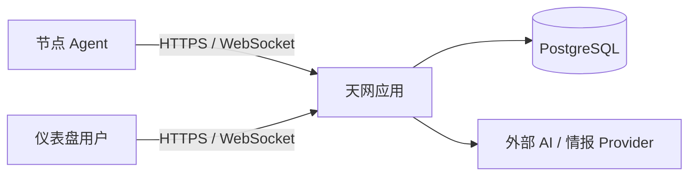

# 天网核心架构 V2 交接

更新时间：2026-09-09

## 1. 新会话目标

重新设计并实施天网核心架构，使登录、仪表盘、Agent 接入、事件存储和基础告警形成一个可独立运行的产品闭环。目标不是让现有九服务 Compose 勉强部署成功，也不是继续修 Kafka 启动顺序。

用户已经确认的核心基线是：**一个天网应用服务 + PostgreSQL**。

## 2. 已确认的架构决策

### 2.1 运行边界

正式运行时只保留两个服务：

1. `app`：Node.js 应用，提供前端静态资源、REST API、用户与 Agent WebSocket、后台任务、规则执行和 AI Provider 适配。
2. `postgres`：保存全部核心持久数据。

前端与后端源码可以继续分目录维护，但生产构建必须形成一个应用镜像。应用直接提供 React 构建产物、API、WebSocket 和 `/health`；既有 Tunnel 直接指向应用端口。

### 2.2 数据边界

PostgreSQL 是唯一核心数据系统：

- 用户、组织、权限、访问会话、设备与 Agent；
- 安全事件、告警、审计记录、系统配置；
- Agent 指标和时间序列数据，使用按时间分区的表；
- 后台任务、重试状态、Outbox 事件和消费游标；
- AI 调用记录、成本和结果引用。

高变化载荷优先使用明确字段加 JSONB 扩展，不为了字段不稳定再引入第二套数据库。只有真实容量和查询证据表明 PostgreSQL 无法满足需求时，才讨论新的专用存储。

### 2.3 数据与任务路径

Agent 通过现有鉴权后的 HTTPS/WebSocket 直接把数据交给应用。应用在同一个数据库事务中写业务数据和 Outbox；应用内 Worker 领取任务并执行告警、通知、AI 调用和后续处理。

需要保证：

- 接收接口可幂等；
- 业务写入与 Outbox 原子提交；
- Worker 使用可恢复租约或 `FOR UPDATE SKIP LOCKED` 领取任务；
- 重试次数、下次执行时间和最终失败原因可见；
- WebSocket 只负责实时通知，不承担唯一持久化通道。

### 2.4 AI 边界

AI 是应用内的可选能力模块，不是主启动依赖。外部模型通过统一 Provider 接口调用；Provider 不可用时，登录、仪表盘、Agent 入库和基础规则告警仍必须正常工作。

现有 Python AI 引擎中的能力需要逐项分类：

- 能直接移入 Node.js 的配置、编排、外部 API 调用和结果归一化；
- 确实依赖 Python/本地模型的能力保留为未来可选执行器，通过稳定任务契约接入；
- 未被真实产品路径使用的训练、模型管理和演示接口不得继续进入核心启动链。

### 2.5 从核心运行时移出的组件

- Kafka 与 ZooKeeper：由 PostgreSQL Outbox 和应用内 Worker 替代。
- InfluxDB：指标和安全事件迁入 PostgreSQL 分区表。
- Redis：访问会话、缓存和任务状态先由 PostgreSQL 承担。
- 独立 Python AI 服务：核心能力并入应用模块，本地模型降为未来可选执行器。
- Nginx：应用直接提供静态资源、API、WebSocket 和健康端点。

这些旧组件的数据卷和历史文件不能因架构调整直接删除。必须先审计数据归属和迁移需求；如需退役非本会话文件，按项目删除禁令列出物理清单并重新取得明确确认。

## 3. 当前代码事实

当前主线提交为 `10398ffc206fe29e8df11ebf0a7283d2c35bddde`，尚未包含 V2 架构实现。

现有核心代码：

- `server/src/index.js` 启动 Express、用户 Socket.IO、Agent WebSocket、数据库和多个辅助服务。
- `server/src/models/` 已有用户、会话、Agent、设备、安全事件、告警、审计和配置等 PostgreSQL 模型。
- `client/` 是 React 仪表盘，当前由独立容器提供。
- `agents/` 与服务端已经通过 WebSocket 交换数据，无须 Kafka 才能建立 Agent 主通道。
- `server/src/config/database.js` 将 PostgreSQL 视为启动必需项；InfluxDB 和 Redis 已按可降级方式处理。
- `server/src/index.js` 捕获 Kafka 初始化失败后仍可继续启动。
- AI 路由和控制器直接调用独立 AI HTTP 服务；部分读取接口已有“不可用”响应，但运行配置恢复仍可能把 AI 变成启动阻塞点。
- `docker-compose.yml` 把所有可选组件提升为 `server.depends_on` 的健康硬依赖，这是当前代码语义与部署语义不一致的核心问题。

## 4. 当前部署与存储现场

- 项目绑定节点：`onex-nextterminal`。
- 域名：`tianwang.szlk.uk`，继续使用既有 Tunnel；不要新增宿主 Nginx。
- 登录凭据保存在项目根目录 `.env`，交接文档不记录任何秘密值。
- 部署 `1312` 使用提交 `10398ffc...`，构建工作流 `34341974093` 已成功完成构建、上传、控制面回调和 Runner 自动回收。
- `1312` 在目标节点导入九个镜像并进入 Compose rollout 后失败：Kafka 在 ZooKeeper 完全就绪前退出，应用链没有启动。该故障只是旧架构症状，不继续作为主线修补。
- 失败后目标节点仍可观察到 1312 的 PostgreSQL、Redis、InfluxDB 和 ZooKeeper 容器；这不代表 V2 已部署。
- OC Runner 所在物理磁盘当前约有 21GB 可用空间。此前空间故障来自多镜像归档、失败 Buildx 残留和旧构建产物。
- Runner 私有 Docker 中仍有 STMWeb 的停止容器和大镜像。现有治理工具无法删除该类任意私有对象，禁止直接修改 Docker 数据目录。

## 5. 新会话实施顺序

### 阶段 A：固定产品闭环和数据库契约

1. 以最终用户动作列出首版必须成立的路径：登录、查看仪表盘、Agent 注册/连接、数据入库、基础告警、退出。
2. 审计这些路径实际读取和写入的模型，不把未使用的旧模块带入新架构。
3. 设计 PostgreSQL 的指标分区表、Outbox、任务、消费游标和必要索引。
4. 明确旧 InfluxDB 数据是否需要迁移；没有证据时不得假定可丢弃。

### 阶段 B：建立应用内模块边界

建议按业务能力形成模块，而不是按基础设施命名：

- identity：用户、会话、权限；
- fleet：Agent、设备、连接；
- telemetry：采集、指标、事件；
- detection：规则、告警、响应；
- automation：Outbox、任务、重试；
- intelligence：AI 与情报 Provider；
- presentation：REST、WebSocket、前端静态资源。

模块先共享同一进程和数据库，但通过清晰接口隔离。不要预先拆微服务。

### 阶段 C：按纵向切片迁移

1. 先让应用镜像同时提供 React、API、用户 WebSocket 和 Agent WebSocket。
2. 保持现有 PostgreSQL 登录与访问会话语义，完成登录—仪表盘—退出回归。
3. 把 Agent 的核心入库路径改为 PostgreSQL 事务写入，不再经过 Kafka。
4. 加入 Outbox Worker，并迁移基础告警和通知任务。
5. 把仪表盘实际使用的指标查询迁入 PostgreSQL；再移除 InfluxDB 调用。
6. 让 Redis 缓存成为可移除实现并删除核心依赖。
7. 把外部 AI 调用收口到 Provider 接口；移除独立 AI 服务的启动依赖。
8. 清除失去消费者的旧依赖、环境变量、路由和用户界面入口，避免留下无法使用的“幽灵功能”。

每个切片先写失败回归，再改实现；不得通过跳过测试、隐藏接口或返回伪数据制造完成。

### 阶段 D：两服务发布

1. 将 Compose 收敛为 `app` 与 `postgres`。
2. `x-gitops.public_entry` 直接指向 `app` 的正式端口和 `/health`。
3. 离线发布只构建和打包两个镜像；目标节点不得依赖临时拉取公网镜像。
4. 保留 PostgreSQL 持久卷；旧组件卷保持隔离，完成迁移与授权后再退役。
5. 使用既有 GitOps 节点、域名和 Tunnel 发布，不新建平行部署路径。

## 6. 验收标准

完成不能只看容器启动。至少验证：

- 生产 Compose 只有 `app` 和 `postgres`，两个服务健康；
- `https://tianwang.szlk.uk/health` 返回天网身份和 200；
- 未登录访问受保护 API 返回 401；
- 使用根目录 `.env` 中的正式凭据登录成功；
- 仪表盘三个核心数据接口返回真实数据库结果；
- 用户 Socket.IO 鉴权成功，退出后旧令牌和旧连接失效；
- Agent 使用完整连接凭据建立 WebSocket，数据可幂等写入并出现在仪表盘；
- Outbox 任务可领取、完成、失败重试并在重启后恢复；
- AI Provider 不可用时核心闭环仍工作，相关页面给出真实的不可用状态；
- 最终生成的 Compose、启动脚本和镜像经过直接语法与运行验证；
- 浏览器从普通用户视角复查，没有暴露内部基础设施、迁移状态或工程说明。

## 7. 新会话的首条指令

可以直接使用下面这段：

> 读取 `docs/core-architecture-v2-handoff.md`、项目 `agent.md` 和相关长期记忆。按已确认的“单体天网应用 + PostgreSQL”核心架构完成正式 V2 设计与分阶段实施。不要继续修补九服务 Compose，也不要只做部署层裁剪。先以登录、仪表盘、Agent 接入、事件入库和基础告警形成纵向闭环，再迁移任务、指标和 AI Provider；按文档验收标准完成代码、测试、提交、推送和 GitOps 生产验收。

## 8. 交接边界

本文件确认方向和执行边界，不宣称 V2 已实现。新会话开始后应先用当前代码、测试、日志和运行状态复核事实；历史文档描述的九服务架构仅作迁移来源，不能继续作为目标架构。
