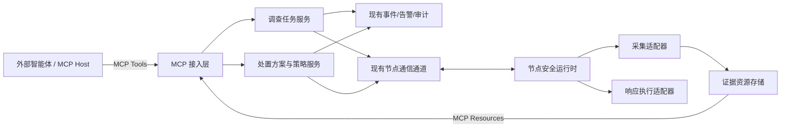
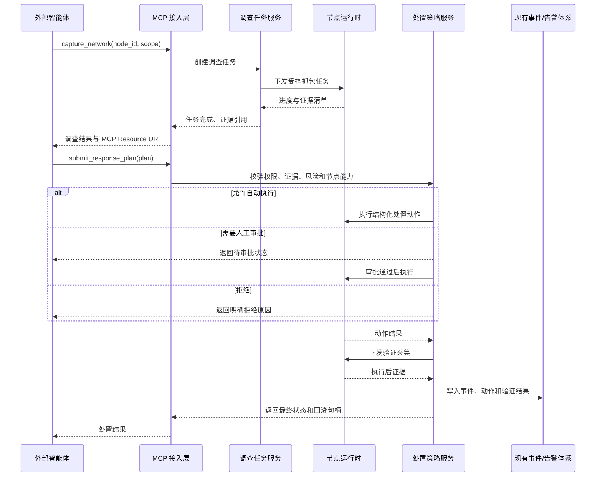

# MCP 外部智能体调查与响应主路径设计

## 1. 文档定位

本文定义天网现有安全监控与主动防护体系中的一条新增一级主路径：外部智能体通过 MCP 对指定节点发起按需取证，获取网络与主机环境证据，分析是否存在击穿现象或风险，生成处置方案，并将方案回传天网完成授权、执行、验证与审计。

这是一项增量能力设计，不重新定义或替换天网现有架构。现有 Agent 持续监测、内部规则检测、AI 分析、告警、仪表盘和自动防护路径保持成立，并与 MCP 主路径共享节点、事件、证据和响应能力。

### 1.1 目标

- 让兼容 MCP 的外部智能体用统一方式调查天网管理的节点。
- 支持按需抓取受限网络包，并同步取得判断风险所需的主机环境上下文。
- 让外部智能体返回机器可校验的结论和处置方案，而不是不可控的自然语言命令。
- 复用现有服务端与节点之间的连接、注册、数据采集、告警和防火墙能力。
- 保证每次取证和处置均有明确权限、作用域、状态、证据、执行结果和回滚路径。

### 1.2 非目标

- 不取消或降级天网现有内部检测和分析能力。
- 不要求外部智能体直接连接节点、取得节点系统账户或执行任意 Shell 命令。
- 不在首版中建设通用远程运维、任意脚本执行或完整 SOAR 编排平台。
- 不以一次模型判断替代证据门槛和节点执行策略。
- 不要求所有操作系统在首版同时具备完全相同的底层采集实现；对外工具心智必须一致，平台差异由节点适配层吸收。

## 2. 现有架构中的位置

天网保留两条相互协作的一级路径。

### 2.1 现有内部监测路径

```text
节点持续监测
  -> 服务端接收数据
  -> 内部规则或 AI 分析
  -> 安全事件与告警
  -> 自动或人工响应
  -> 仪表盘与通知
```

### 2.2 新增 MCP 调查与响应路径

```text
外部智能体
  -> MCP 请求指定节点取证
  -> 服务端创建调查任务
  -> 通过现有节点连接下发受控采集命令
  -> 节点生成证据并回传
  -> 外部智能体分析证据并提交处置方案
  -> 服务端校验权限、风险和执行策略
  -> 节点执行处置并再次采集验证
  -> 结果进入现有事件、告警、审计和仪表盘
```

两条路径不是互斥关系：现有内部告警可以触发外部智能体深入调查；外部智能体也可以主动调查指定节点；外部分析结果可以交给现有规则和人工审批机制决定是否执行。

## 3. 设计原则

### 3.1 统一节点心智

外部智能体只需要理解节点、调查、证据、结论、处置方案和执行结果，不需要理解节点使用 `iptables`、`pfctl`、Windows Firewall、`tcpdump` 或其他平台实现。

### 3.2 语义直接，网络不直连

“直接抓包”指外部智能体可以通过一次 MCP 工具调用指定节点和采集条件，并取得该节点的抓包结果。节点不需要暴露公网 MCP 服务；服务端继续利用现有节点注册和长连接完成任务路由。

### 3.3 证据与动作分离

取证默认只读，处置属于独立授权域。允许某个智能体采集证据，不等于允许它阻断网络、终止进程或隔离节点。

### 3.4 方案先于执行

外部智能体提交结构化处置方案。天网先进行 Schema、权限、节点能力、目标范围和风险校验，再决定自动执行、等待审批或拒绝。

### 3.5 结果必须验证

“命令返回成功”不等于处置目标已经达成。处置结束后必须执行方案中声明的验证步骤，并返回执行前后状态差异。

### 3.6 所有临时动作可收敛

临时阻断、隔离和采集任务必须设置期限与资源上限。每项可变更动作必须具备幂等标识、精确作用域和回滚方法。

## 4. 逻辑架构



### 4.1 MCP 接入层

职责：

- 对外暴露 MCP Tools 和 Resources。
- 认证外部智能体并解析节点、工具和动作授权。
- 将 MCP 调用转换为内部调查任务或处置方案。
- 返回任务状态、结构化结果和证据资源引用。

MCP 接入层不直接执行系统命令，也不内置平台特定抓包逻辑。

### 4.2 调查任务服务

职责：

- 创建、调度、取消和查询调查任务。
- 校验目标节点在线状态和能力。
- 通过现有节点通信通道下发采集任务。
- 接收阶段进度、证据清单和最终结果。
- 管理任务超时、重试和结果幂等。

### 4.3 处置方案与策略服务

职责：

- 校验外部智能体提交的处置方案。
- 结合智能体授权、节点策略和动作风险决定执行方式。
- 生成不可变的执行版本和审批要求。
- 跟踪执行、验证和回滚状态。
- 将结果同步到现有安全事件与告警体系。

### 4.4 节点安全运行时

职责：

- 声明当前节点真实支持的采集和响应能力。
- 执行服务端签发的受控任务，不接受任意命令文本。
- 对采集时长、过滤条件、文件大小、CPU、磁盘和并发进行本地硬限制。
- 生成证据元数据和哈希。
- 执行精确作用域的处置动作并返回系统实际状态。

## 5. 与现有实现的复用关系

| 现有模块 | 保留职责 | MCP 主路径中的增量职责 |
| --- | --- | --- |
| `agents/src/services/AgentService.js` | 节点注册、认证、连接、消息收发 | 增加调查任务、处置任务和任务回执消息类型 |
| `agents/src/services/NetworkMonitor.js` | 周期性接口、吞吐和连接监测 | 为按需证据包提供连接、接口和 socket/PID 上下文 |
| `agents/src/services/SystemMonitor.js` | 周期性系统与进程监测 | 为指定调查时刻提供进程、资源和主机快照 |
| `agents/src/services/FirewallService.js` | 节点防火墙管理 | 作为结构化处置动作的底层适配器，补齐精确回滚和执行校验 |
| `server/src/services/WebSocketService.js` | 服务端与节点长连接 | 路由调查任务、处置任务、进度、结果和取消请求 |
| `server/src/controllers/agentController.js` | 节点数据接收和安全事件创建 | 接收调查证据摘要并关联现有安全事件 |
| 现有 AI、规则和威胁情报能力 | 内部检测和分析 | 可触发 MCP 调查、补充外部结论或复核处置方案 |
| 现有告警和仪表盘 | 展示安全事件和处置状态 | 展示调查来源、证据、外部结论、审批、执行与验证结果 |

需要新增但不替换现有模块：

- 服务端 MCP 接入模块。
- 调查任务服务与持久化模型。
- 证据资源服务与元数据模型。
- 处置方案、审批和执行记录模型。
- 节点网络包采集服务。
- 节点结构化响应执行器与平台适配器。

## 6. 主路径时序



## 7. MCP 能力契约

MCP Tools 用于发起动作和查询状态；MCP Resources 用于读取可能较大的证据内容。PCAP 不直接以内联 Base64 作为常规工具结果返回。

抓包和复合环境取证属于长任务。若 MCP Host 与服务端均支持 MCP Tasks 扩展，调查工具可以返回标准任务句柄；不支持时仍可通过 `investigation_id` 和 `get_investigation` 查询。两种模式必须映射到同一个内部 Investigation，不能产生两套任务状态。

### 7.1 节点与能力工具

#### `list_nodes`

列出当前智能体有权访问的节点，不返回其他项目或租户节点。

#### `get_node_status`

返回节点在线状态、平台、Agent 版本、最后心跳、活动调查和策略状态。

#### `get_node_capabilities`

返回节点实际可用能力，例如：

```json
{
  "node_id": "node-123",
  "collection": {
    "network_capture": true,
    "connection_snapshot": true,
    "process_snapshot": true,
    "system_logs": true,
    "auth_events": false
  },
  "response": {
    "block_remote_ip": true,
    "terminate_process": false,
    "isolate_node": false
  },
  "limits": {
    "max_capture_seconds": 120,
    "max_capture_bytes": 52428800,
    "max_concurrent_investigations": 1
  }
}
```

### 7.2 调查工具

#### `capture_network`

对指定节点发起受限网络包采集。

```json
{
  "node_id": "node-123",
  "interface": "auto",
  "duration_seconds": 60,
  "filter": {
    "peer_ips": ["203.0.113.10"],
    "protocols": ["tcp"],
    "ports": [443]
  },
  "max_bytes": 52428800,
  "include_context": [
    "connections",
    "processes",
    "dns",
    "firewall"
  ],
  "reason": "调查疑似异常外联"
}
```

过滤条件必须由结构化字段生成平台命令，不接受原始 BPF、Shell 或 PowerShell 文本作为首版公开参数。

#### `collect_host_snapshot`

按指定范围采集连接、进程、系统资源、DNS、认证事件、日志摘要和防火墙状态。调用方必须明确选择所需范围，避免默认收集所有敏感数据。

#### `get_investigation`

返回调查任务状态、进度、错误、证据清单和到期时间。

#### `cancel_investigation`

请求停止仍在运行的采集任务。节点必须终止采集进程、关闭文件句柄并报告已经产生的临时资源如何处置。

### 7.3 处置工具

#### `validate_response_plan`

只进行静态和策略校验，不改变节点状态。返回每个动作的风险、所需审批、节点支持情况和拒绝原因。

#### `submit_response_plan`

提交不可变的处置方案版本。提交后如需修改，必须生成新版本，不能原地改变已审批方案。

#### `execute_response_plan`

执行已经满足策略和审批要求的方案。重复调用同一幂等键不得产生重复规则或重复终止动作。

#### `get_response_execution`

返回当前动作、节点实际状态、验证结果、临时动作到期时间和回滚可用性。

#### `rollback_response_plan`

精确撤销该方案创建且仍可撤销的动作，不得清空同一节点上的其他天网规则。

### 7.4 证据资源

建议资源 URI：

```text
tianwang://nodes/{node_id}/investigations/{investigation_id}/manifest
tianwang://nodes/{node_id}/investigations/{investigation_id}/summary
tianwang://nodes/{node_id}/investigations/{investigation_id}/artifacts/{artifact_id}
```

资源读取必须再次执行节点、项目、调查和证据范围授权，不能因为知道 URI 就获得访问权。

## 8. 内部任务协议

MCP 接入层不直接复用外部请求作为节点命令。服务端应生成标准内部任务信封：

```json
{
  "protocol_version": 1,
  "task_id": "task-001",
  "case_id": "case-001",
  "node_id": "node-123",
  "task_type": "capture-network",
  "issued_at": "2026-08-27T12:00:00Z",
  "deadline_at": "2026-08-27T12:02:00Z",
  "idempotency_key": "investigation-001-capture-1",
  "authorization": {
    "grant_id": "grant-001",
    "allowed_capability": "network.capture"
  },
  "params": {
    "interface": "auto",
    "duration_seconds": 60,
    "max_bytes": 52428800,
    "filter": {
      "peer_ips": ["203.0.113.10"]
    }
  }
}
```

节点回执：

```json
{
  "task_id": "task-001",
  "node_id": "node-123",
  "status": "succeeded",
  "started_at": "2026-08-27T12:00:01Z",
  "finished_at": "2026-08-27T12:01:02Z",
  "artifacts": [
    {
      "artifact_id": "artifact-001",
      "type": "application/vnd.tcpdump.pcap",
      "size_bytes": 1204932,
      "sha256": "..."
    }
  ],
  "metrics": {
    "captured_packets": 8421,
    "dropped_packets": 3
  }
}
```

## 9. 数据模型

### 9.1 Investigation

关键字段：

- `id`、`case_id`、`node_id`
- `source`: `mcp`、`internal_alert`、`manual`
- `requested_by`、`authorization_grant_id`
- `request_scope`
- `status`
- `started_at`、`deadline_at`、`finished_at`
- `evidence_manifest_id`
- `error_code`、`error_message`

状态：

```text
requested -> authorized -> dispatched -> collecting -> uploading -> succeeded
     |            |            |             |            |
     +----------> rejected      +-----------> failed <-----+
                                  \----------> cancelled
```

终态为 `succeeded`、`failed`、`cancelled` 或 `rejected`。服务端和节点必须能用 `task_id` 对账，不能仅依赖连接内存状态。

### 9.2 EvidenceManifest

关键字段：

- 调查、节点和时间范围。
- 采集器名称、版本和平台。
- 每个证据资源的类型、大小、哈希、敏感级别和到期时间。
- 抓包过滤条件、包数、丢包数和截断原因。
- 证据产生失败或缺失项。

证据清单本身也需要完整性保护。外部智能体的结论必须引用具体证据 ID，不能只引用自然语言摘要。

### 9.3 Finding

外部智能体返回的判断：

```json
{
  "case_id": "case-001",
  "node_id": "node-123",
  "classification": "probable_compromise",
  "confidence": 0.88,
  "evidence_refs": ["artifact-001", "artifact-002"],
  "observations": [
    {
      "type": "suspicious_egress",
      "subject": "process:3482",
      "evidence_ref": "artifact-001"
    }
  ],
  "limitations": ["TLS payload not decrypted"]
}
```

允许的判断状态：

- `no_evidence`
- `suspicious`
- `probable_compromise`
- `confirmed_compromise`

`confirmed_compromise` 必须满足天网策略定义的证据要求，不能只依靠置信度数字。

### 9.4 ResponsePlan

```json
{
  "id": "plan-001",
  "version": 1,
  "case_id": "case-001",
  "node_id": "node-123",
  "finding_ref": "finding-001",
  "evidence_refs": ["artifact-001"],
  "idempotency_key": "case-001-plan-1",
  "actions": [
    {
      "id": "action-001",
      "type": "block_remote_ip",
      "target": "203.0.113.10",
      "ttl_seconds": 900,
      "expected_effect": "阻止节点与目标 IP 建立新连接"
    }
  ],
  "verification": [
    {
      "type": "connection_absent",
      "target": "203.0.113.10"
    }
  ],
  "rollback": [
    {
      "type": "remove_created_firewall_rule",
      "action_ref": "action-001"
    }
  ]
}
```

首版不接受包含任意命令、脚本、文件删除或通配目标的方案。

## 10. 权限与风险模型

### 10.1 授权维度

每次 MCP 调用至少校验：

- 智能体身份。
- 项目或租户范围。
- 可访问节点集合。
- 可调用能力。
- 数据敏感级别。
- 最大采集持续时间和资源量。
- 可执行动作及其风险等级。
- 授权有效期。

远程 MCP 使用短期访问令牌，令牌必须绑定当前 MCP 资源服务，禁止把入站令牌透传给节点或其他服务。

### 10.2 动作分级

| 等级 | 示例 | 默认策略 |
| --- | --- | --- |
| R0 只读 | 节点状态、能力查询 | 授权范围内直接执行 |
| R1 受限取证 | 短时抓包、连接和进程快照 | 授权范围内执行并审计 |
| R2 临时控制 | 有 TTL 的 IP 阻断、限时策略 | 节点策略允许后自动执行或要求轻量审批 |
| R3 高影响控制 | 终止进程、节点隔离、持久策略变更 | 必须明确人工审批 |
| R4 禁止 | 任意 Shell、删除证据、清空防火墙、关闭天网 | 始终拒绝 |

### 10.3 本地最终裁决

即使服务端已经授权，节点仍必须检查任务签名、期限、能力、参数边界、本地保护对象和当前系统状态。节点拒绝执行时必须返回稳定错误码和具体原因，服务端不得通过改变命令形式绕过节点策略。

### 10.4 可验证安全要求

| 编号 | 要求 | 验收标准 |
| --- | --- | --- |
| SR-001 | 所有远程 MCP 调用必须认证并执行节点级授权 | 使用有效令牌访问未授权节点返回拒绝；其他项目节点不会出现在列表中 |
| SR-002 | 取证权限与处置权限必须分离 | 仅有 `network.capture` 权限的智能体无法提交或执行 IP 阻断 |
| SR-003 | 节点不得接受任意命令文本 | MCP、内部任务和 ResponsePlan Schema 均拒绝 Shell、PowerShell、原始命令行和通配动作 |
| SR-004 | 证据必须可验证来源和完整性 | 每个资源包含节点、调查、采集时间、采集器和 SHA-256；篡改后校验失败 |
| SR-005 | 采集必须受本地资源上限约束 | 超时长、超大小和超并发请求在节点执行前被拒绝或按声明上限截断 |
| SR-006 | 可变更动作必须幂等且可精确回滚 | 重复幂等键只产生一个系统对象；回滚不影响其他天网规则或用户配置 |
| SR-007 | 节点拥有执行最终裁决权 | 过期、签名错误、能力不支持或违反本地策略的任务即使来自服务端也会被拒绝 |
| SR-008 | 调查与处置必须形成不可抵赖的审计链 | 能从 case 追溯智能体、授权、节点任务、证据、结论、审批、动作、验证和回滚 |
| SR-009 | 所有采集内容必须按不可信输入处理 | 网络载荷或日志中的指令文本不会改变工具权限、任务参数或自动触发处置 |
| SR-010 | 处置完成必须由新证据确认 | 仅命令成功但验证条件不成立时，状态保持 `not_verified`，不得报告处置完成 |

## 11. 证据与隐私

- 默认只采集解决当前调查所需的最小范围。
- 抓包必须设置持续时间和最大字节数，达到任一上限立即停止并标记截断。
- PCAP、认证日志和进程命令行应按敏感数据存储和传输。
- 工具结果中的网络载荷、日志、文件内容均标记为“不可信证据内容”，不能被解释为对智能体或系统的指令。
- 证据资源应设置到期时间；到期处置必须可审计。
- 删除已到期证据属于独立生命周期任务，不与调查工具调用混在同一执行中。
- 外部智能体获得的是授权范围内的资源引用，不是底层文件系统路径。

## 12. 处置执行要求

### 12.1 结构化适配

节点响应执行器将固定动作翻译为平台 API 或参数化系统调用。不得把外部智能体提供的 `reason`、目标或备注直接拼接进 Shell 命令。

### 12.2 幂等

同一 `idempotency_key` 的重复请求必须返回同一个执行对象。服务重试、MCP 重试或节点重连不得制造重复防火墙规则。

### 12.3 精确回滚

每个执行动作记录其创建或变更的系统对象标识。回滚只能撤销该执行对象，不得清空同一节点上的其他规则或用户配置。

### 12.4 执行后验证

验证结果至少区分：

- `verified`：预期状态已由新证据确认。
- `partially_verified`：部分动作生效或证据不足。
- `not_verified`：命令成功但预期状态未出现。
- `verification_failed`：无法完成验证采集。

只有 `verified` 才能表示处置目标已达成。

## 13. 错误与恢复

| 场景 | 系统行为 |
| --- | --- |
| 节点离线 | 调查保持可查询；是否等待节点上线由任务期限决定，不伪装成已下发 |
| 抓包工具不可用 | 返回能力不支持或采集器错误，不返回空 PCAP 冒充成功 |
| 达到文件上限 | 停止抓包，保留已取得证据并标记 `truncated` |
| 节点执行后断线 | 进入 `reconciling`，节点重连后根据执行对象查询真实状态 |
| 部分动作成功 | 停止后续依赖动作，进入部分失败状态，根据方案决定回滚已成功动作 |
| 外部智能体超时 | 已创建的调查继续按自身期限运行；调用方可用任务 ID 查询，不重复创建 |
| 证据上传失败 | 节点按配额暂存并重试；服务端明确区分采集成功和上传成功 |
| 审批过期 | 方案不得执行，重新提交或重新审批后生成新的执行版本 |

## 14. 审计与可观测性

每次调查和响应必须能够回答：

- 哪个智能体、用户或内部事件发起。
- 访问了哪个节点和哪些数据。
- 使用了哪些采集条件和资源上限。
- 节点实际执行了什么。
- 产生了哪些证据及其哈希。
- 外部智能体基于哪些证据得出什么结论。
- 谁批准了哪些动作。
- 动作是否达到预期、何时到期、是否回滚。

日志中不得记录访问令牌、完整连接密钥、敏感 PCAP 内容或不必要的命令行秘密。

关键指标：

- 调查成功率和各阶段耗时。
- 节点拒绝、超时和能力不支持比例。
- 抓包字节数、截断率和丢包率。
- 方案校验通过率与审批等待时间。
- 动作执行成功率与验证成功率。
- 自动回滚和人工回滚次数。

## 15. 前台呈现

MCP 主路径复用现有节点、事件和告警心智，不新增一套需要用户理解的内部对象页面。普通用户主要完成以下动作：

- 在现有节点详情中查看正在进行的调查和证据状态。
- 在现有告警详情中查看外部智能体结论及其证据依据。
- 审批高影响处置方案。
- 查看执行结果、验证状态、到期时间和回滚入口。

调查任务、证据清单和执行对象是后端稳定对象，但前台以“调查进展”和“处置结果”表达，不直接暴露协议消息、队列、平台命令或适配器差异。

## 16. 首版交付范围

首版选择一个实际部署平台跑通完整闭环；若没有额外产品约束，工程验证优先使用 Linux 节点，但对外 MCP 契约不绑定 Linux。

### 16.1 必须交付

- 远程 MCP 身份认证和节点级授权。
- 节点能力查询。
- 指定节点的受限网络包采集。
- 与抓包同步的连接和进程快照。
- 证据清单、哈希、资源引用和过期时间。
- 外部智能体 Finding 和 ResponsePlan 提交。
- ResponsePlan 静态校验和策略判定。
- 有 TTL 的精确 IP 阻断。
- 执行后连接状态验证。
- 精确回滚或到期自动解除。
- 调查、审批、执行、验证和回滚审计。
- 与现有安全事件和告警体系关联。

### 16.2 暂不进入首版

- 任意 VQL、Shell、PowerShell 或脚本执行。
- 抓取完整磁盘或完整内存。
- 自动终止进程和自动隔离节点。
- 多节点批量处置。
- TLS 解密和敏感凭证获取。
- 对所有平台同时实现相同深度的底层采集。
- 由 MCP 主路径替换现有内部 AI、规则、告警或仪表盘。

## 17. 首版验收场景

目标场景：外部智能体调查某节点到指定可疑 IP 的异常外联，并在授权后实施临时阻断。

1. 外部智能体只能列出其获授权的节点。
2. 智能体对在线节点发起 60 秒、指定目标 IP、最大 50 MiB 的网络包采集。
3. 节点同时返回连接与进程关联快照。
4. 结果包含 PCAP、证据清单、SHA-256、包数、丢包数、时间范围和是否截断。
5. 智能体提交引用具体证据的 `probable_compromise` Finding。
6. 智能体提交“阻断目标 IP 15 分钟”的 ResponsePlan。
7. 天网完成权限、目标、TTL、节点能力和方案完整性校验。
8. 节点只创建该方案对应的精确防火墙规则。
9. 系统再次采集连接状态，确认目标外联已经消失。
10. MCP 返回执行对象、验证结果、到期时间和回滚句柄。
11. 重复提交相同幂等键不会创建第二条规则。
12. 到期或回滚后只撤销该方案创建的规则，并再次确认节点状态。
13. 全流程可从现有事件或告警记录追溯。

### 17.1 负向验收

- 未授权智能体无法查看节点、调查或证据。
- 超过节点时长、文件大小或并发上限的抓包请求被明确拒绝。
- 包含原始命令、通配目标或禁止动作的方案被拒绝。
- 过期、错误节点或错误 audience 的令牌不能调用工具。
- 被篡改的内部任务或证据哈希不能进入执行链。
- 防火墙命令返回成功但验证仍发现目标连接时，结果不得标记为已完成。
- 节点断线后系统不得把未知状态报告为执行成功。

## 18. 分阶段实现顺序

### 阶段 A：只读调查闭环

1. MCP 身份、节点授权和能力查询。
2. 调查任务及节点命令/回执协议。
3. 受限抓包与连接、进程快照。
4. 证据存储、资源读取和审计。

完成标志：外部智能体可以稳定取得可验证证据，但不能改变节点状态。

### 阶段 B：受控处置闭环

1. Finding 与 ResponsePlan 模型。
2. 方案校验、风险分级和审批。
3. 临时 IP 阻断的参数化平台适配器。
4. 执行后验证、幂等和精确回滚。

完成标志：首版验收场景从调查到回滚完整通过。

### 阶段 C：与现有系统融合

1. 内部告警触发 MCP 调查。
2. 外部结论回写安全事件和告警。
3. 现有 AI、规则与外部结论的协同。
4. 节点和告警页面中的调查、审批及处置呈现。

完成标志：MCP 主路径成为现有天网产品中的一级能力，而不是独立旁路工具。

## 19. 实现前必须确认的部署参数

以下内容不改变本文架构，但实现前需要根据首个真实部署环境确定：

- 首版目标平台及最低操作系统版本。
- 节点抓包使用的平台适配器和权限安装方式。
- PCAP 默认和最大保留时间。
- 首版 MCP 是单项目部署还是需要多租户隔离。
- R2 临时阻断默认自动执行还是默认人工审批。
- 外部智能体的身份来源和授权管理入口。

在这些参数确认前，可以先完成与平台无关的任务、证据、Finding、ResponsePlan 和 MCP 契约实现；不得用平台特例改变外部智能体的统一调用方式。

## 20. 参考

- [现有总体架构](./architecture-design.md)
- [首版部署与验收说明](./mcp-agent-investigation-response-v1-operations.md)
- [MCP 官方规范](https://modelcontextprotocol.io/specification/)
- [MCP 授权规范](https://modelcontextprotocol.io/specification/2026-07-28/basic/authorization)
