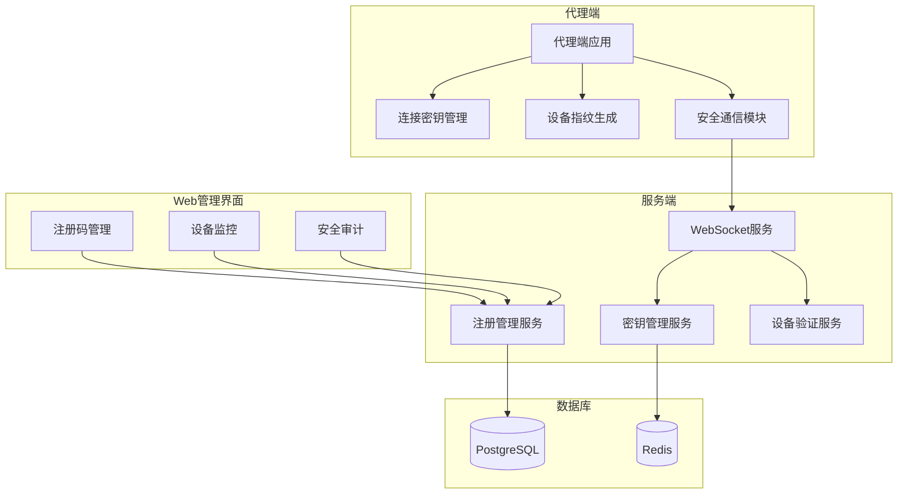

# 规划蓝图：代理端安全连接与注册管理系统
*   **状态**: [已完成]

## 1. 核心目标与验收标准 (Core Objective & Acceptance Criteria)

### a. 核心目标 (Core Objective)
*   为天网安全监控系统建立完整的代理端安全连接机制和便捷的注册管理平台，确保代理端与服务端之间的通信安全，并提供用户友好的代理端注册、管理和监控功能。

### b. 验收标准 (Acceptance Criteria)
*   `[ ]` **连接密钥管理**: 实现基于RSA非对称加密的连接密钥系统，支持密钥生成、分发、轮换和验证。
*   `[ ]` **代理端注册界面**: 在Web管理界面中提供完整的代理端注册管理功能，包括注册码生成、设备信息查看、状态监控等。
*   `[ ]` **设备指纹验证**: 实现基于硬件特征、系统信息的设备指纹验证机制，防止代理端被恶意复制。
*   `[ ]` **安全通信协议**: 建立基于TLS/SSL的安全通信协议，确保数据传输的机密性和完整性。
*   `[ ]` **注册码管理**: 提供注册码生成、分发、验证和过期管理功能，支持批量生成和权限控制。
*   `[ ]` **代理端状态监控**: 实时监控代理端连接状态、数据上报情况、系统资源使用等关键指标。
*   `[ ]` **安全审计日志**: 记录所有代理端注册、连接、认证等安全相关操作，支持审计追溯。

## 2. 现状分析与复用性尽职调查 (Current State Analysis & Reuse Due Diligence)

### a. 复用性尽职调查
*   **搜索关键词**: `agent`, `register`, `authentication`, `websocket`, `jwt`, `security`
*   **搜索范围**: `server/src/`, `client/src/`, `agents/src/`
*   **发现与结论**:
    *   现有JWT认证机制可复用，但需要增强安全性
    *   现有WebSocket连接机制可复用，但需要添加密钥验证
    *   现有代理注册API可复用，但需要增加注册码验证
    *   现有设备管理界面可复用，但需要增加注册管理功能
    *   **结论**: 在现有架构基础上进行安全增强和功能扩展

### b. 潜在影响分析
*   需要修改代理端和服务端的认证流程
*   需要更新WebSocket连接验证机制
*   需要扩展数据库模型以支持新的安全特性
*   需要更新前端界面以支持注册管理功能

## 3. 技术方案与架构设计 (Technical Approach & Architecture Design)

### 安全架构设计
*   **连接密钥系统**: RSA-2048非对称加密，支持密钥轮换
*   **设备指纹**: 基于硬件UUID、MAC地址、系统信息的唯一标识
*   **注册码系统**: 基于时间戳和随机数的安全注册码生成
*   **通信加密**: TLS 1.3 + 应用层AES-256-GCM加密

### 技术栈选择
*   **后端**: Node.js + Express + crypto模块
*   **前端**: React + TypeScript + Ant Design
*   **数据库**: PostgreSQL + Redis缓存
*   **加密**: Node.js内置crypto模块 + 第三方安全库

### 系统架构图

## 4. 任务分解与上下文锚点 (Task Breakdown & Context Anchors)

### 第一阶段：后端安全架构增强 (状态: `未开始`)
*   `[ ]` **1.1: 连接密钥管理系统**
    *   实现RSA密钥对生成和管理
    *   创建密钥分发和轮换机制
    *   实现密钥验证中间件
*   `[ ]` **1.2: 设备指纹验证系统**
    *   实现设备指纹生成算法
    *   创建设备指纹验证服务
    *   集成到代理端认证流程
*   `[ ]` **1.3: 注册码管理系统**
    *   实现注册码生成和验证
    *   创建注册码权限控制
    *   集成到代理端注册流程
*   `[ ]` **1.4: **(验证点/上下文锚点)** 后端安全功能测试

### 第二阶段：代理端安全增强 (状态: `未开始`)
*   `[ ]` **2.1: 代理端密钥管理**
    *   集成连接密钥获取和存储
    *   实现密钥验证和轮换
    *   更新WebSocket连接流程
*   `[ ]` **2.2: 代理端设备指纹**
    *   实现设备指纹生成
    *   集成到注册和认证流程
    *   更新系统信息收集
*   `[ ]` **2.3: 代理端注册码支持**
    *   集成注册码验证
    *   更新注册流程
    *   实现注册码输入界面
*   `[ ]` **2.4: **(验证点/上下文锚点)** 代理端安全功能测试

### 第三阶段：Web管理界面开发 (状态: `未开始`)
*   `[ ]` **3.1: 注册码管理界面**
    *   创建注册码生成和管理页面
    *   实现注册码分发功能
    *   集成权限控制
*   `[ ]` **3.2: 代理端监控界面**
    *   增强设备管理页面
    *   添加安全状态监控
    *   实现实时状态更新
*   `[ ]` **3.3: 安全审计界面**
    *   创建安全事件日志页面
    *   实现审计报告功能
    *   集成搜索和过滤
*   `[ ]` **3.4: **(验证点/上下文锚点)** 前端功能完整性测试

### 第四阶段：系统集成与测试 (状态: `未开始`)
*   `[ ]` **4.1: 端到端集成测试**
    *   测试完整的注册和连接流程
    *   验证安全机制的有效性
    *   测试异常情况处理
*   `[ ]` **4.2: 性能和安全测试**
    *   进行负载测试
    *   执行安全渗透测试
    *   验证加密强度
*   `[ ]` **4.3: **(验证点/上下文锚点)** 生产环境部署验证

## 5. 风险评估与应对策略 (Risk Assessment & Mitigation Plan)

### 技术风险
*   **风险1**: 密钥管理复杂性导致系统不稳定
    *   **应对**: 采用成熟的密钥管理库，实现渐进式部署
*   **风险2**: 设备指纹可能被绕过或伪造
    *   **应对**: 使用多重验证机制，定期更新指纹算法
*   **风险3**: 注册码系统可能被滥用
    *   **应对**: 实现注册码使用限制和审计机制

### 业务风险
*   **风险4**: 安全机制过于复杂影响用户体验
    *   **应对**: 设计用户友好的界面，提供详细的操作指南
*   **风险5**: 现有代理端需要升级
    *   **应对**: 实现向后兼容，提供平滑升级路径

## 6. 成功指标与评估标准 (Success Metrics & Evaluation Criteria)

### 技术指标
*   **安全性**: 连接密钥验证成功率 ≥ 99.9%
*   **性能**: 注册流程响应时间 < 3秒
*   **可用性**: 系统可用性 ≥ 99.9%
*   **兼容性**: 现有代理端升级成功率 ≥ 95%

### 业务指标
*   **用户体验**: 代理端注册时间 < 5分钟
*   **管理效率**: 批量注册码生成时间 < 10秒
*   **安全合规**: 通过安全审计要求

---

**创建时间**: 2025-08-10 15:00:00
**文档版本**: v1.0
**负责人**: AI Assistant
**状态**: [规划中]
