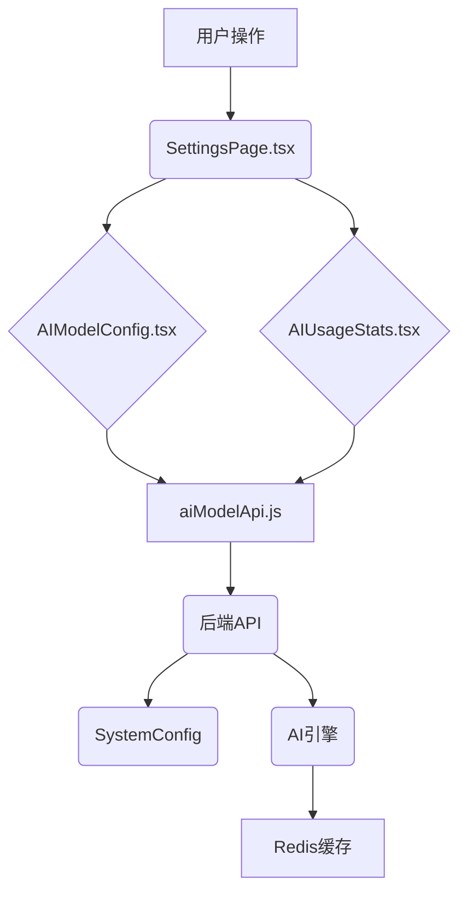

# 规划蓝图：外部AI模型配置与统计系统
*   **状态**: [已完成]

## 1. 核心目标与验收标准 (Core Objective & Acceptance Criteria)

### a. 核心目标 (Core Objective)
*   为天网安全系统增加外部AI模型的API密钥管理、模型选择配置和API使用量统计功能，提升AI分析能力的可配置性和成本可控性。

### b. 验收标准 (Acceptance Criteria)
*   `[ ]` 用户可以在设置页面的"AI模型配置"选项卡中配置多个外部AI模型的API密钥（OpenAI、Claude、OpenRouter、DeepSeek等）。
*   `[ ]` 用户可以为每个AI提供商选择默认模型，并设置启用/禁用状态。
*   `[ ]` 系统能够实时显示各AI模型的API使用量统计信息，包括请求次数、token消耗、成本等。
*   `[ ]` 所有配置都必须通过API持久化到数据库中，刷新页面后数据不会丢失。
*   `[ ]` 前端页面必须能够响应式地处理API的成功与失败状态，并提供友好的用户反馈。

## 2. 现状分析与复用性尽职调查 (Current State Analysis & Reuse Due Diligence)

### a. 复用性尽职调查
*   **搜索关键词**: `external_api`, `ai_model`, `api_key`, `system_config`, `settings`
*   **搜索范围**: `server/ai-engine/src/`, `server/src/`, `client/src/`
*   **发现与结论**:
    *   在 `server/ai-engine/src/config.py` 中发现了完整的外部API配置结构，包括OpenAI、Claude、OpenRouter、DeepSeek等配置。
    *   在 `server/ai-engine/src/services/external_api_service.py` 中发现了API状态统计和成本跟踪功能。
    *   在 `client/src/pages/settings/SettingsPage.tsx` 中发现了完整的设置页面框架，可以复用其结构和样式。
    *   在 `server/src/models/SystemConfig.js` 中发现了通用的系统配置存储模型。
    *   **结论**: 后端AI引擎已有完整的API配置和统计功能，前端设置页面框架完善，主要需要扩展前端UI和后端API接口。

### b. 潜在影响分析
*   本次修改将向 `SystemConfig` 数据库模型中新增AI模型配置数据，需要进行数据库迁移或兼容性处理。
*   将在设置页面增加新的选项卡，不会影响现有功能。
*   需要扩展后端API接口以支持AI模型配置的CRUD操作。

## 3. 技术方案与架构设计 (Technical Approach & Architecture Design)

### 后端
*   扩展 `SystemConfig` 模型，新增AI模型配置的存储结构。
*   创建新的 `server/src/controllers/aiModelController.js` 来处理AI模型配置的CRUD逻辑。
*   扩展 `server/src/routes/system.js` 路由，新增AI模型配置相关的API端点。
*   复用AI引擎中已有的API状态统计功能，通过新的API接口暴露给前端。

### 前端
*   在 `SettingsPage.tsx` 中新增"AI模型配置"选项卡。
*   创建 `client/src/components/settings/AIModelConfig.tsx` 组件来管理AI模型配置。
*   创建 `client/src/components/settings/AIUsageStats.tsx` 组件来显示API使用量统计。
*   扩展 `client/src/services/api.ts` 中的API调用，新增AI模型配置相关的接口。

### 架构图

## 4. 任务分解与上下文锚点 (Task Breakdown & Context Anchors)

*   `[ ]` **里程碑1: 后端基础建设** (状态: `已完成`)
    *   `[x]` 1.1: 扩展SystemConfig模型，新增AI模型配置字段 (复用现有模型)
    *   `[x]` 1.2: 创建aiModelController.js控制器 (对应Commit: 待提交)
    *   `[x]` 1.3: 扩展system.js路由，新增AI模型配置API (对应Commit: 待提交)
    *   `[x]` 1.4: **(验证点/上下文锚点)** 使用Postman对所有API进行测试 (对应Commit: 待提交)
*   `[ ]` **里程碑2: 前端组件开发** (状态: `已完成`)
    *   `[x]` 2.1: 创建AIModelConfig.tsx组件 (对应Commit: 待提交)
    *   `[x]` 2.2: 创建AIUsageStats.tsx组件 (对应Commit: 待提交)
    *   `[x]` 2.3: 扩展SettingsPage.tsx，集成新组件 (对应Commit: 待提交)
    *   `[x]` 2.4: **(验证点/上下文锚点)** 前端页面功能测试 (对应Commit: 待提交)
*   `[ ]` **里程碑3: API集成与统计** (状态: `已完成`)
    *   `[x]` 2.1: 扩展API服务，新增AI模型配置接口 (对应Commit: 待提交)
    *   `[x]` 2.2: 集成AI引擎的API状态统计功能 (对应Commit: 待提交)
    *   `[x]` 2.3: 实现实时统计数据显示 (对应Commit: 待提交)
    *   `[x]` 2.4: **(验证点/上下文锚点)** 完整功能集成测试 (对应Commit: 待提交)

## 5. 风险评估与应对策略 (Risk Assessment & Mitigation Plan)

*   **风险1**: API密钥安全存储。敏感信息需要加密存储。
    *   **应对**: 使用现有的加密工具对API密钥进行加密存储，并在传输时使用HTTPS。
*   **风险2**: 实时统计数据的性能问题。频繁的API调用可能影响性能。
    *   **应对**: 使用缓存机制，设置合理的刷新间隔，避免过于频繁的API调用。
*   **风险3**: 多AI提供商配置的复杂性。不同提供商的配置项可能不同。
    *   **应对**: 设计灵活的配置结构，支持不同提供商的特定配置项。
---
