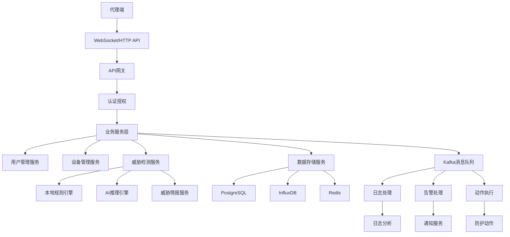

# 规划蓝图：系统核心功能完善与AI威胁检测集成
*   **状态**: [规划中]

## 1. 核心目标与验收标准 (Core Objective & Acceptance Criteria)

### a. 核心目标 (Core Objective)
*   完善天网安全监控系统的核心功能模块，实现完整的AI威胁检测能力，建立高效的数据存储和分析体系，确保系统具备生产环境级别的安全监控和威胁响应能力。

### b. 验收标准 (Acceptance Criteria)
*   `[ ]` 系统能够实时收集、存储和分析代理端发送的所有类型数据（系统、网络、日志、安全）
*   `[ ]` AI威胁检测引擎能够准确识别和分类安全威胁，误报率低于5%
*   `[ ]` 消息队列系统能够可靠处理高并发的安全事件数据
*   `[ ]` 用户管理系统提供完整的用户认证、授权和管理功能
*   `[ ]` 系统配置管理支持动态配置更新和系统状态监控
*   `[ ]` 所有核心API端点都有完整的实现和错误处理
*   `[ ]` 系统性能满足1000+并发代理的数据处理需求
*   `[ ]` 数据存储支持历史数据查询和实时数据分析

## 2. 现状分析与复用性尽职调查 (Current State Analysis & Reuse Due Diligence)

### a. 复用性尽职调查
*   **搜索关键词**: `InfluxDB`, `AI engine`, `threat detection`, `user management`, `kafka`, `security event`
*   **搜索范围**: `server/src/`, `server/ai-engine/`, `client/src/`
*   **发现与结论**:
    *   在 `server/src/config/database.js` 中发现了InfluxDB配置，但缺少具体的存储实现
    *   在 `server/ai-engine/` 中发现了完整的AI引擎架构，但缺少与主系统的集成
    *   在 `server/src/models/` 中发现了完整的数据模型，但部分API路由未实现
    *   在 `server/src/config/kafka.js` 中发现了Kafka配置，但消息处理逻辑未实现
    *   **结论**: 基础设施已完备，主要缺少业务逻辑实现和系统集成

### b. 潜在影响分析
*   本次修改将涉及核心数据处理流程，需要确保向后兼容性
*   将新增AI威胁检测功能，可能影响系统性能，需要优化
*   将完善用户管理系统，需要迁移现有用户数据
*   将集成时序数据库，需要数据迁移策略

## 3. 技术方案与架构设计 (Technical Approach & Architecture Design)

### a. 数据存储架构
*   **PostgreSQL**: 存储结构化数据（用户、设备、配置、安全事件）
*   **InfluxDB**: 存储时序数据（系统性能、网络流量、日志数据）
*   **Redis**: 缓存和会话管理
*   **Kafka**: 消息队列和事件流处理

### b. AI威胁检测架构
*   **本地模型**: 轻量级规则引擎，实时威胁检测
*   **云端模型**: 深度学习模型，复杂威胁分析
*   **混合推理**: 智能调度本地和云端模型
*   **威胁情报**: 集成外部威胁情报源

### c. 系统集成架构
*   **微服务架构**: 模块化设计，独立部署
*   **事件驱动**: 基于Kafka的事件流处理
*   **API网关**: 统一的API管理和认证
*   **监控告警**: 完整的系统监控和告警机制

### d. 架构图

## 4. 任务分解与上下文锚点 (Task Breakdown & Context Anchors)

### 里程碑1: 数据存储基础设施 (状态: `未开始`)
*   `[ ]` 1.1: 实现InfluxDB数据存储服务
    *   创建时序数据存储接口
    *   实现系统性能数据存储
    *   实现网络流量数据存储
    *   实现日志数据存储
    *   **验证点**: 所有代理数据能够正确存储到InfluxDB
*   `[ ]` 1.2: 优化PostgreSQL数据模型
    *   完善用户管理相关表结构
    *   优化安全事件存储结构
    *   添加数据索引和约束
    *   **验证点**: 数据库查询性能满足要求
*   `[ ]` 1.3: 实现Redis缓存服务
    *   用户会话缓存
    *   系统配置缓存
    *   威胁检测结果缓存
    *   **验证点**: 缓存命中率达到80%以上

### 里程碑2: AI威胁检测引擎 (状态: `未开始`)
*   `[ ]` 2.1: 集成AI推理引擎
    *   连接AI引擎服务
    *   实现威胁检测API
    *   添加模型管理功能
    *   **验证点**: AI引擎能够正确响应威胁检测请求
*   `[ ]` 2.2: 实现本地规则引擎
    *   基础威胁规则
    *   异常行为检测
    *   实时威胁评分
    *   **验证点**: 本地规则引擎响应时间小于100ms
*   `[ ]` 2.3: 威胁情报集成
    *   MISP威胁情报
    *   OTX威胁情报
    *   本地威胁库
    *   **验证点**: 威胁情报更新及时，覆盖率达到90%

### 里程碑3: 消息队列处理系统 (状态: `未开始`)
*   `[ ]` 3.1: 完善Kafka消息处理
    *   安全日志消息处理
    *   安全告警消息处理
    *   防护动作消息处理
    *   **验证点**: 消息处理延迟小于1秒
*   `[ ]` 3.2: 实现事件流处理
    *   实时事件聚合
    *   事件关联分析
    *   异常事件检测
    *   **验证点**: 能够处理1000+并发事件
*   `[ ]` 3.3: 消息可靠性保障
    *   消息重试机制
    *   死信队列处理
    *   消息监控告警
    *   **验证点**: 消息丢失率小于0.1%

### 里程碑4: 用户管理系统 (状态: `未开始`)
*   `[ ]` 4.1: 实现用户管理API
    *   用户列表和详情API
    *   用户创建和更新API
    *   用户权限管理API
    *   **验证点**: 所有用户管理API正常工作
*   `[ ]` 4.2: 完善认证功能
    *   JWT令牌刷新
    *   用户登出功能
    *   密码修改功能
    *   **验证点**: 认证流程安全可靠
*   `[ ]` 4.3: 权限控制系统
    *   基于角色的访问控制
    *   细粒度权限管理
    *   权限审计日志
    *   **验证点**: 权限控制准确有效

### 里程碑5: 系统配置管理 (状态: `未开始`)
*   `[ ]` 5.1: 系统配置API
    *   配置获取和更新API
    *   配置验证和回滚
    *   配置变更通知
    *   **验证点**: 配置管理功能完整
*   `[ ]` 5.2: 系统监控和统计
    *   系统性能监控
    *   业务指标统计
    *   健康检查接口
    *   **验证点**: 监控数据准确及时
*   `[ ]` 5.3: 系统告警机制
    *   性能告警
    *   错误告警
    *   安全告警
    *   **验证点**: 告警及时准确

### 里程碑6: 代理端功能完善 (状态: `未开始`)
*   `[ ]` 6.1: 网络诊断功能
    *   网络连通性检测
    *   网络性能测试
    *   网络配置诊断
    *   **验证点**: 网络诊断功能可用
*   `[ ]` 6.2: 事件详情展示
    *   安全事件详情
    *   系统事件详情
    *   网络事件详情
    *   **验证点**: 事件详情展示完整
*   `[ ]` 6.3: 配置重载功能
    *   动态配置更新
    *   配置验证机制
    *   配置回滚功能
    *   **验证点**: 配置重载安全可靠

### 里程碑7: 系统集成测试 (状态: `未开始`)
*   `[ ]` 7.1: 端到端测试
    *   完整业务流程测试
    *   性能压力测试
    *   故障恢复测试
    *   **验证点**: 所有测试通过
*   `[ ]` 7.2: 安全测试
    *   认证授权测试
    *   数据安全测试
    *   威胁防护测试
    *   **验证点**: 安全测试通过
*   `[ ]` 7.3: 部署验证
    *   生产环境部署
    *   监控告警验证
    *   用户验收测试
    *   **验证点**: 生产环境稳定运行

## 5. 风险评估与应对策略 (Risk Assessment & Mitigation Plan)

### 风险1: AI模型性能问题
*   **风险描述**: AI威胁检测模型可能影响系统响应时间
*   **影响程度**: 高
*   **应对策略**: 
    *   实现模型缓存和预加载
    *   使用异步处理机制
    *   建立模型性能监控
    *   准备降级方案

### 风险2: 数据存储性能瓶颈
*   **风险描述**: 大量时序数据可能导致存储性能问题
*   **影响程度**: 中
*   **应对策略**:
    *   实现数据分片和分区
    *   优化查询索引
    *   建立数据归档策略
    *   监控存储性能指标

### 风险3: 消息队列可靠性
*   **风险描述**: Kafka消息处理可能丢失或重复
*   **影响程度**: 中
*   **应对策略**:
    *   实现消息幂等性处理
    *   建立消息重试机制
    *   监控消息处理状态
    *   准备消息恢复方案

### 风险4: 用户数据迁移
*   **风险描述**: 现有用户数据迁移可能丢失
*   **影响程度**: 高
*   **应对策略**:
    *   制定详细的数据迁移计划
    *   建立数据备份机制
    *   进行迁移测试验证
    *   准备回滚方案

### 风险5: 系统兼容性
*   **风险描述**: 新功能可能影响现有系统
*   **影响程度**: 中
*   **应对策略**:
    *   保持API向后兼容
    *   进行充分的回归测试
    *   建立功能开关机制
    *   准备快速回滚方案

## 6. 资源需求与时间规划 (Resource Requirements & Timeline)

### 人力资源需求
*   **后端开发**: 2-3人，负责数据存储、AI集成、消息队列
*   **前端开发**: 1-2人，负责用户界面和配置管理
*   **AI工程师**: 1人，负责威胁检测模型优化
*   **测试工程师**: 1人，负责系统测试和验证
*   **运维工程师**: 1人，负责部署和监控

### 技术资源需求
*   **开发环境**: 高性能开发服务器
*   **测试环境**: 完整的测试环境
*   **AI计算资源**: GPU服务器用于模型训练
*   **存储资源**: 大容量存储用于数据存储
*   **网络资源**: 稳定的网络连接

### 时间规划
*   **第一阶段** (4周): 数据存储基础设施
*   **第二阶段** (6周): AI威胁检测引擎
*   **第三阶段** (3周): 消息队列处理系统
*   **第四阶段** (3周): 用户管理系统
*   **第五阶段** (2周): 系统配置管理
*   **第六阶段** (2周): 代理端功能完善
*   **第七阶段** (2周): 系统集成测试
*   **总计**: 22周 (约5.5个月)

## 7. 成功指标与监控 (Success Metrics & Monitoring)

### 技术指标
*   **系统性能**: 响应时间 < 200ms，吞吐量 > 1000 TPS
*   **AI检测**: 准确率 > 95%，误报率 < 5%
*   **数据存储**: 查询响应时间 < 100ms
*   **消息处理**: 延迟 < 1秒，丢失率 < 0.1%
*   **系统可用性**: 99.9% 可用性

### 业务指标
*   **威胁检测**: 威胁检出率 > 90%
*   **用户满意度**: 用户满意度 > 4.5/5
*   **系统稳定性**: 故障恢复时间 < 5分钟
*   **数据完整性**: 数据丢失率 < 0.01%

### 监控体系
*   **系统监控**: CPU、内存、磁盘、网络
*   **应用监控**: API响应时间、错误率、吞吐量
*   **业务监控**: 威胁检测数量、用户活跃度
*   **安全监控**: 安全事件、异常访问、威胁告警

## 8. 后续规划与扩展 (Future Planning & Extension)

### 短期扩展 (3-6个月)
*   移动端应用开发
*   多租户支持
*   高级报表功能
*   自动化响应机制

### 中期扩展 (6-12个月)
*   云原生部署
*   边缘计算支持
*   机器学习模型优化
*   威胁情报共享

### 长期规划 (1-2年)
*   全球威胁情报网络
*   自适应安全架构
*   量子安全加密
*   AI驱动的安全运营

---

**蓝图创建时间**: 2025-01-17 00:00:00  
**蓝图版本**: v1.0  
**负责人**: AI助手  
**审核人**: 待定

